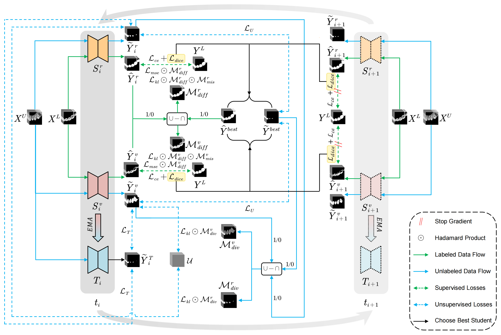

# 🚆 RAIL: Region-Aware Instructive Learning for Semi-Supervised Tooth Segmentation in CBCT

 
 
 
 
 

(http://arxiv.org/abs/2505.03538)

by [Chuyu Zhao<sup>*</sup>](https://github.com/Tournesol-Saturday), [Hao Huang<sup>*</sup>](https://github.com/haohuang2003), [Jiashuo Guo<sup>*</sup>](https://github.com/JiashuoGuo), Ziyu Shen<sup>*</sup>, Zhongwei Zhou, Jie Liu<sup>†</sup>, Zekuan Yu<sup>†</sup> 

*These authors contributed equally to this work.  
†Corresponding author: jieliu@bjtu.edu.cn, yzk@fudan.edu.cn

## 🌟 Abstract

Semi-supervised learning has become a compelling approach for 3D tooth segmentation from CBCT scans, where labeled data is minimal. However, existing methods still face two persistent challenges: limited corrective supervision in structurally ambiguous or mislabeled regions during supervised training and performance degradation caused by unreliable pseudo-labels on unlabeled data. To address these problems, we propose Region-Aware Instructive Learning (RAIL), a dual-group dual-student, semi-supervised framework. Each group contains two student models guided by a shared teacher network. By alternating training between the two groups, RAIL promotes intergroup knowledge transfer and collaborative region-aware instruction while reducing overfitting to the characteristics of any single model. Specifically, RAIL introduces two instructive mechanisms. Disagreement-Focused Supervision (DFS) Controller improves supervised learning by instructing predictions only within areas where student outputs diverge from both ground truth and the best student, thereby concentrating supervision on structurally ambiguous or mislabeled areas. In the unsupervised phase, Confidence-Aware Learning (CAL) Modulator reinforces agreement in regions with high model certainty while reducing the effect of low-confidence predictions during training. This helps prevent our model from learning unstable patterns and improves the overall reliability of pseudo-labels. Extensive experiments on four CBCT tooth segmentation datasets show that RAIL surpasses state-ofthe-art methods under limited annotation.

## 📰 News!

- **[05/7/2025]** RAIL framework code and models are now available! Please check out the [GitHub repository](#) for more details.
- **[04/18/2025]** We provide RAIL model checkpoints trained on 3D_CBCT_Tooth_7_113, 3D_CBCT_Tooth_13_107, CTooth_7_115 and CTooth_13_109.
  Link: https://pan.baidu.com/s/1EXFAeZLMZJLqWjyfUQQkBA?pwd=jqxg. Extraction Code: `jqxg`

## 🧑‍🏫 Overview



RAIL (Region-Aware Instructive Learning) is a novel dual-group, dual-student semi-supervised framework for medical image segmentation, specifically designed to address the issue of limited labeled data in CBCT-based 3D tooth segmentation. This approach introduces two key mechanisms:
- 🔧 **Disagreement-Focused Supervision (DFS) Controller:** Focuses on areas where model predictions diverge to improve supervision in anatomically ambiguous or mislabeled regions.
- 🎯 **Confidence-Aware Learning (CAL) Modulator:** Enhances model stability by reinforcing high-confidence predictions and suppressing low-confidence pseudo-labels.

RAIL outperforms state-of-the-art methods under limited annotation scenarios, improving both segmentation accuracy and model reliability in medical imaging tasks.

## Requirements


## ⚙️ Environment

Please follow these steps to create an environment and install the environment dependencies by `requirements.txt`:

```bash
conda create -n RAIL python=3.8
conda activate RAIL
git clone https://github.com/Tournesol-Saturday/RAIL.git;
cd ./RAIL;
pip install -r requirements.txt
```

[Optional] Download the model checkpoint and save it at `./model/RAIL_xx_xx_xx/outputs/xx/pmt_0_iter_xxxx_best.pth`
`./model/RAIL_xx_xx_xx/outputs/xx/pmt_1_iter_xxxx_best.pth`
`./model/RAIL_xx_xx_xx/outputs/xx/pmt_2_iter_xxxx_best.pth`
`./model/RAIL_xx_xx_xx/outputs/xx/pmt_3_iter_xxxx_best.pth`.

## 📦 Dataset Preparation

We obtained two public datasets and preprocessed them in some way. All datasets are placed in the `./dataset` directory after preprocessing (data augmentation).

### 📊 Dataset Preprocessing (Data Augmentation)

To expand the training dataset, we augmented the available CBCT scans by 1) intensity normalization, and 2) random cropped patches.

In this study, our CBCT data are stored in `.h5` format, which records the corresponding annotation information for a given scanned image (if it is an unlabeled image, the corresponding annotation information is all zeros). For both the training and validation sets (excluding the testing set), the data is scaled up to 15 times for each scan.

In `dataloaders/data_augmentation.py`, you need to define the paths to the image and annotation folders of the CBCT scans, and then you can use the following commands to implement the augmentation of labeled data:

```
dataloaders/data_augmentation.py
```

Then you can use the following command to implement the augmentation of unlabeled data:

```
dataloaders/data_augmentation_unlabeled.py
```

### 🗂️ Dataset Directory Structure

  1. [3D CBCT Tooth Dataset](https://pan.baidu.com/share/init?surl=0qf6k10GE9OHYcJ76wrx-w&pwd=6ad8):

```
./dataset/CBCT_13_107/
	CBCT_data/
		labeled_1000889125_20171009_0/
			CBCT_roi.h5
		......
		unlabeled_X2360674_14/
			CBCT_roi.h5
	Flods/
		train.list
		val.list
		test.list

./dataset/CBCT_7_113/
	CBCT_data/
		labeled_1000889125_20171009_0/
			CBCT_roi.h5
		......
		unlabeled_X2360674_14/
			CBCT_roi.h5
	Flods/
		train.list
		val.list
		test.list
```
  2. [CTooth dataset](https://github.com/liangjiubujiu/CTooth):

```
./dataset/CTooth_13_109/
	CTooth_data/
		labeled_1000889125_20171009_0/
			CBCT_roi.h5
		......
		unlabeled_X2360674_14/
			CBCT_roi.h5
	Flods/
		train.list
		val.list
		test.list

./dataset/CTooth_7_115/
	CTooth_data/
		labeled_Teeth_0001_0000_0/
			CBCT_roi.h5
		......
		unlabeled_Teeth_0013_0000_14/
			CBCT_roi.h5
	Flods/
		train.list
		val.list
		test.list
```

## 🚀 Usage

```
cd RAIL/code
```
To train our model,
```
python train_RAIL.py
```
To test our model,
```
python test_CBCT.py
```

## 🧾 Citation

If you use this project in your work, please cite the following paper:

```bibtex
@article{zhao2025rail,
  title = {RAIL: Region-Aware Instructive Learning for Semi-Supervised Tooth Segmentation in CBCT},
  author = {Chuyu Zhao and
          Hao Huang and
          Jiashuo Guo and
          Ziyu Shen and
          Zhongwei Zhou and
          Jie Liu and
          Zekuan Yu},
  journal = {arXiv preprint arXiv:2505.03538},
  keywords = {CBCT tooth segmentation, confidence-aware learning, disagreement-focused supervision, semi-supervised learning},
  year = {2025}
}
```

## 🙏 Acknowledgements

We would like to acknowledge the contributions of the following projects:

- [PMT](https://github.com/Axi404/PMT)
- [SDCL](https://github.com/pascalcpp/SDCL)
